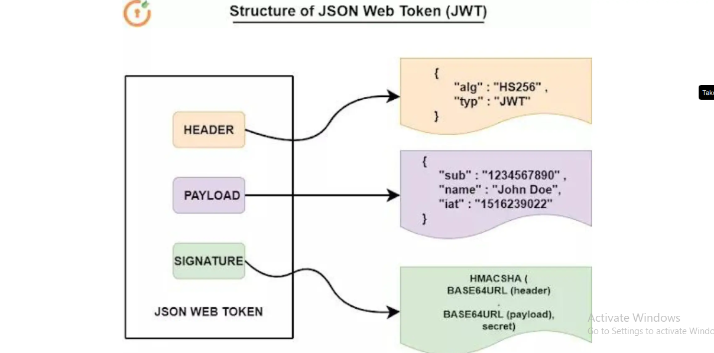
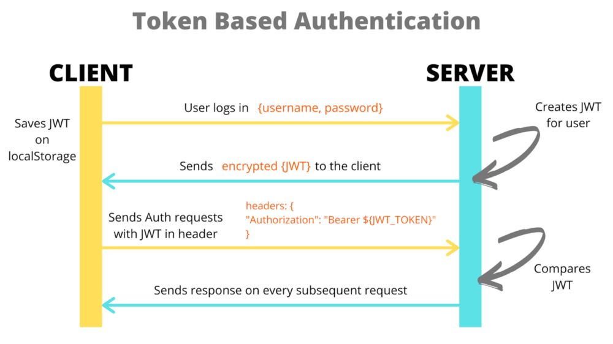
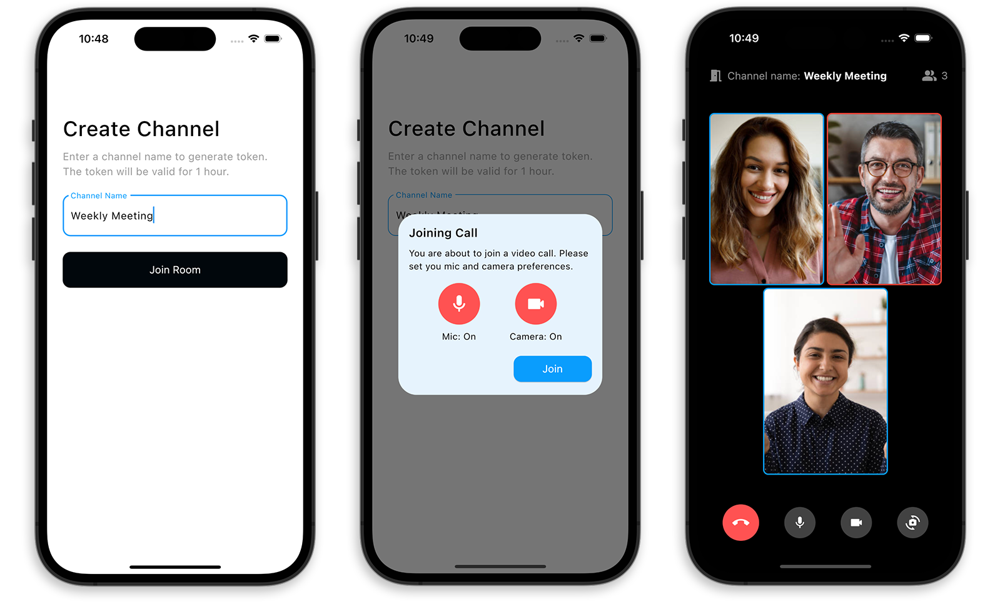

## User Signup and Email Validation

When a user signs up, we validate their email by sending them a confirmation email.

### How It Sends Mail to the User

This is achieved using the SendGrid API from Twilio.


```plaintext
-------------------
* when user signup we validate his mail by sending mail to him
-------------------
* how it send mail to user ?
**by using sendgrid api twilio sendgrid**
-------------------
```

### Example Code to Send an Email

```javascript
const sgMail = require('@sendgrid/mail');

// Set the API key
sgMail.setApiKey('SENDGRID_API_KEY');

// Define the email content
const msg = {
  to: 'to@example.com',
  from: 'from@example.com', // Use the email address or domain you verified with SendGrid
  subject: 'Email Verification',
  html: '<strong>Verify your email by clicking the link</strong>',
};

// Send the email
sgMail
  .send(msg)
  .then(() => {
    console.log('Email sent');
  })
  .catch((error) => {
    console.error(error);
  });
```


---

## JSON Web Token (JWT)

In our login system, we use JWT to authenticate users.

### What is JWT and How It Works?

JWT (JSON Web Token) is used in security for authentication, authorization, and information exchange. 

#### Structure of a JWT:

A JWT consists of three parts: Header, Payload, and Signature.

1. **Header:** This contains the type of token (JWT) and the signing algorithm.
2. **Payload:** This contains the claims, which are statements about an entity (typically, the user) and additional data.
3. **Signature:** This is used to verify the message wasn't changed along the way and, in the case of tokens signed with a private key, can verify the sender of the JWT.

```plaintext
-----------------------------------------
Structure of a JWT:
Break down the three parts of a JWT: Header, Payload, and Signature.
-----------------------------------------
example of jwt
eyJhbGciOiJIUzI1NiIsInR5cCI6IkpXVCJ9.eyJzdWIiOiIxMjM0NTY3ODkwIiwibmFtZSI6IkpvaG4gRG9lIiwiaWF0IjoxNE2MjM5MDIyfQ.
SflKxwRJSMeKKF2QT4fwpMeJf36POk6yJV_adQssw5c
-----------------------------------------
```



### How JWT is Used in Our Application

1. **User Signs In:** The server sends a JWT to the user, and the user stores it in `flutterSecureStorage`.

2. **User Sends Request:** When the user sends a request to the server, they include the JWT in the header. The server checks the JWT, and if it is valid, the server sends a response to the user.

```plaintext
-----------------------------------------
when user sign in, server send jwt to user and user store it in local storage
in our case in flutterSecureStorage
-----------------------------------------
when user send request to server, user send jwt in header of request
server check jwt and if it is valid, server send response to user
-----------------------------------------
```

---

## Video Call (RTC AGORA)

We use the Flutter plugin of Agora RTC SDK, `agora_rtc_engine`, to integrate video calling or live video streaming into our app with just a few lines of code.

### What is WebRTC?

WebRTC is a free, open-source project that provides web browsers and mobile applications with real-time communication via simple APIs. It allows audio and video communication to work inside web pages by enabling direct peer-to-peer communication, eliminating the need to install plugins or download native apps.


#### Features of WebRTC

- Access to the camera and microphone
- Capture and send video and audio in real-time
- Get the status of the session, such as if the user is connected or disconnected

### How We Use Agora SDK

When the user clicks on the video call, we use the Agora SDK to initiate the video call.



#### Explanation of Agora SDK

Agora SDK is a real-time communication library that allows you to add voice and video chat to your app. It provides the UI for video calls and APIs to manage the calls. It opens a secure socket connection for video calls and manages the session.

---